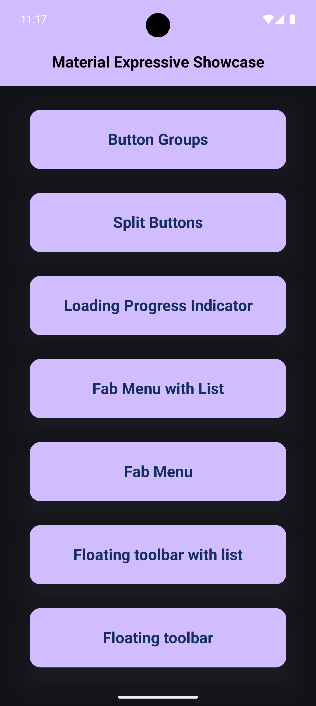

# Material 3 Expressive Components for Jetpack Compose

[](https://linktr.ee/nicos_nicolaou)
[](https://nicosnicolaou16.github.io/)
[](https://twitter.com/nicolaou_nicos)
[](https://linkedin.com/in/nicos-nicolaou-a16720aa)
[](https://medium.com/@nicosnicolaou)
[](https://androiddev.social/@nicolaou_nicos)
[](https://bsky.app/profile/nicolaounicos.bsky.social)
[](https://dev.to/nicosnicolaou16)
[](https://www.youtube.com/@nicosnicolaou16)
[](https://g.dev/nicolaou_nicos)

A curated collection of modern, expressive UI components built with **Jetpack Compose** and *
*Material 3**.  
This repository serves as both **inspiration** and a **practical reference**, showcasing how to
craft dynamic, engaging Android interfaces using Compose animations and Material 3’s expressive
design system.

Each example is self-contained and demonstrates a specific interaction pattern, animation technique,
or Material 3 component.

---

## 🚀 Future Implementation

This project is actively maintained and will continue to grow. In the future, we plan to:

- Add more **Material 3 expressive components**
- Include **new animation and interaction patterns**
- Keep the repository **up-to-date** with the latest Material 3 and Jetpack Compose releases
- Expand the **sample demos** for learning and inspiration

Stay tuned for updates, and contributions are always welcome!

---

## ✨ Components

### **Expressive Buttons**

Fluid, delightful buttons that animate in response to user interaction.

### **Button Groups**

Connected single- and multi-selection button groups following Material 3’s expressive design.

### **Split Buttons**

Compound buttons featuring a primary action and a secondary dropdown menu—ideal for multi-action
workflows.

### **FAB Menus**

Floating Action Buttons that expand into contextual menus—available both standalone and integrated
with list content.

### **Floating Toolbars**

Elegant contextual toolbars that appear and disappear with smooth animations during scroll events.

### **Custom Progress Indicators**

Beautifully styled and animated linear and circular indicators, including expressive variants.

---

## 📸 Examples

|                   List of Buttons                   |                   Button Groups                    |                   Split Buttons                    |
|:---------------------------------------------------:|:--------------------------------------------------:|:--------------------------------------------------:|
|  |  |  |
|         *Various expressive button styles.*         |   *Toggleable single & multi-selection buttons.*   |         *Primary action + secondary menu.*         |

|                   FAB Menu with List                    |                   Floating Toolbars with List                   |                   Progress Indicators                   |
|:-------------------------------------------------------:|:---------------------------------------------------------------:|:-------------------------------------------------------:|
|  |  |  |
| *FAB expanding into a menu tied to scrolling content.*  |           *Toolbar that appears with list scrolling.*           |       *Expressive, animated progress indicators.*       |

---

## 📦 Installation & Setup

To use or explore the expressive Material 3 components in this repository, follow these steps:

## **1. Clone the Repository**

```bash
git clone https://github.com/NicosNicolaou16/Material_3_Expressive_List.git
```

## 🧾 Versioning

Material 3 version: 1.5.0-alpha09 <br />
Target SDK version: 36 <br />
Minimum SDK version: 29 <br />
Kotlin version: 2.2.21 <br />
Gradle version: 8.13.1 <br />

## ⭐ Stargazers

If you enjoy this project, please give it a star!
Check out all the stargazers
here: [Stargazers on GitHub](https://github.com/NicosNicolaou16/Material_3_Expressive_List/stargazers)

## 🔗 References

- [Material Expressive](https://m3.material.io/blog/building-with-m3-expressive)
    - [Buttons Group](https://m3.material.io/components/button-groups/overview?utm_source=blog&utm_medium=referral&utm_campaign=IO25) <br />
    - [Split Buttons](https://m3.material.io/components/split-button/overview?utm_source=blog&utm_medium=referral&utm_campaign=IO25) <br />
    - [Loading Indicator](https://m3.material.io/components/loading-indicator/overview?utm_source=blog&utm_medium=referral&utm_campaign=IO25)
    - [Progress Indicator](https://developer.android.com/reference/kotlin/androidx/compose/material3/package-summary#LinearWavyProgressIndicator(androidx.compose.ui.Modifier,androidx.compose.ui.graphics.Color,androidx.compose.ui.graphics.Color,androidx.compose.ui.graphics.drawscope.Stroke,androidx.compose.ui.graphics.drawscope.Stroke,androidx.compose.ui.unit.Dp,kotlin.Float,androidx.compose.ui.unit.Dp,androidx.compose.ui.unit.Dp))
    - [Fab Menu with list and Fab Menu standalone](https://m3.material.io/components/fab-menu/overview?utm_source=blog&utm_medium=referral&utm_campaign=IO25) <br />
    - [Floating Toolbar with list and Floating Toolbar standalone](https://m3.material.io/components/toolbars/overview?utm_source=blog&utm_medium=referral&utm_campaign=IO25) <br />